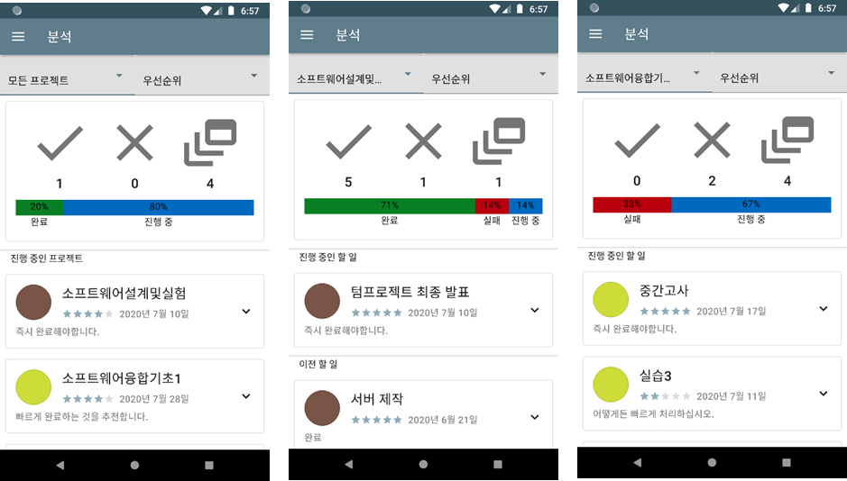

# 우선 순위 기반 시간 관리 어플리케이션 개발 (Priority based time management application development)

소프트웨어 설계 및 실험 과목 텀프로젝트로 제작되었습니다.  
It was produced as a term project for Computer_Software_Design_and_Lab (CP33987)  
텀 프로젝트 수행 기간(Term project execution period) : 2020-04-06 ~ 2020-07-11  
어플리케이션 실행 영상 요약(Application demo video) :   
텀 프로젝트 발표 영상(Term project presentation) : 

서론
====

### 1. 문제 정의

__________________

&nbsp;현대 사회의 복잡도가 심화되면서 현대인들의 주요 고민은 시간 관리 문제가 되었습니다.
(오지현, 2008) 시간 관리 문제에서 오는 스트레스는 시간 관리 능력이 부족하기
때문에 발생하며 시간 계획을 세우고 계획에 따라 생활하며 일을 순서에 따라 처리할
수 있는 시간 관리 능력이 필요합니다. (오현진 & 정지윤, 2006) 시간 관리를 어렵게
하는 요인은 시간 관리 개념과 방법에 대한 인식 부족입니다. (김영치, 2005) 실제로
학생 537명을 대상으로 한 설문조사에서 85.8%가 시간 관리의 필요성을 느끼나 79.9%는
구체적인 시간 관리 방법이 없다고 답했습니다. (김주리, 2012)

>\<표1\> 시간 관리 필요성과 시간 관리 방법, (김주리, 2012)

### 2. 문제 해결 필요성

-------------------

&nbsp;주어진 시간은 모두에게 동등하나 각각에게 상대적입니다. 각 개인의 사용 방법이나
시기에 따라 그 가치는 매우 달라질 수 있습니다. 시간이 유한하다는 사실과 모든
활동에 꼭 사용되는 자원이라는 면에서 시간 관리의 중요성이 더욱 강조됩니다.
(오현진 & 정지윤, 2006) 기존의 꽉 찬 일정을 시간 관리 척도로 여겼던 관점에서
벗어나 자신의 목표와 일의 중요도, 긴급도를 고려한 효율적인 시간 관리로 시간 관리
중요성에 대한 인식이 전환되고 있습니다. (오지현, 2008)

&nbsp;시간 관리 문제를 겪는 대부분의 사람들은 시간 관리의 필요성은 느끼지만 시간 관리
방법을 모르기 때문에 고통받고 있습니다. (김주리, 2012) 계획을 짜는 일은 귀찮고
시간이 오래 걸리는 일이며 오히려 방해하기도 한다고 생각합니다. (김영치, 2005) 할
일도 하고자 하는 일도 많은데 시간은 부족하고 어떤 일부터 시작해야 할지
막막해하고 고민하며, 미루고 미루다 기한을 넘기는 경우도 있습니다.

### 3. 기존 시스템

--------------

&nbsp;많은 사람들이 시간 관리 문제 해결을 위한 아이디어를 구현해왔습니다. 시간 관리
문제 해결에 있어 고전적이며 간단한 방법은 할 일을 생각나는 순서로 일이 생길
때마다 기록하는 것입니다. 그냥 메모하거나 할 일 리스트, 체크리스트를 만들 수
있습니다. 이것을 날자별로 정리하며 캘린더가 됩니다. PC와 휴대 전화 같은 기기가
등장하면서 분실 위험이 적고 언제든지 확인할 수 있다는 이점을 가져 많은 시간 관리
응용 프로그램이 개발되고 있습니다.

<table style="width: 97%; margin-left: 1.5%">
    
    <thead>
    <tr style="font-size: x-large">
        <th colspan="7" style="background-color:#607D8B; padding: 10px">
            시간 관리 어플리케이션 비교
        </th>
    </tr>
    </thead>
    <tbody>
    <tr class="first">
        <td style="width: 4em">아이콘</td>
        <td class="icon"></td>
        <td class="icon"></td>
        <td class="icon"></td>
        <td class="icon"></td>
        <td class="icon"></td>
        <td class="icon"></td>
    </tr>
    <tr class="second">
        <td>이름</td>
        <td>컬러노트</td>
        <td>똑똑 노트</td>
        <td>Google 캘린더</td>
        <td>잊지마 할일</td>
        <td>To Do</td>
        <td>To-Do!</td>
    </tr>
    <tr class="first">
        <td>순위</td>
        <td>21위</td>
        <td>22위</td>
        <td>34위</td>
        <td>64위</td>
        <td>94위</td>
        <td>102위</td>
    </tr>
    <tr class="second">
        <td>종류</td>
        <td>메모, 캘린더</td>
        <td>메모, 체크리스트</td>
        <td>캘린더</td>
        <td>체크리스트</td>
        <td>체크리스트</td>
        <td>체크리스트, 캘린더</td>
    </tr>
    <tr class="first">
        <td>추가 기능</td>
        <td>날짜별, 색별</td>
        <td>생활 맞춤 (계좌, 생일)</td>
        <td>날짜별, 오늘</td>
        <td>X</td>
        <td>날짜별, 색별 오늘, 반복적</td>
        <td>날짜별, 오늘</td>
    </tr>
    <tr class="second">
        <td>동기화</td>
        <td>O</td>
        <td>X(백업)</td>
        <td>O</td>
        <td>X</td>
        <td>O</td>
        <td>X</td>
    </tr>
    </tbody>
</table>

>\<표2\> 시간 관리 어플리케이션 비교, Google Play 생산성 카테고리, (Google, 2020)

&nbsp;그러나 기존의 시간 관리 어플리케이션에서는 단순히 일정 또는 기한을 표시할 뿐 각
일에 대한 중요도와 긴급도를 고려하지 않기 때문에 사용자가 일일이 일을 분석하여
우선 순위를 파악하고 결정해야하는 불편함이 있습니다. 또한 뚜렷한 시간 관리
방법을 제시하지 않아 시간 관리의 필요성은 느끼지만 효율적인 시간 관리 방법을
몰라 시간 계획을 세우는 것을 기피하는 사람들에게 도움이 되지 못합니다.

&nbsp;변화하는 시간 관리 인식에 발맞추어 기존의 꽉 찬 캘린더를 시간 관리 척도로 여겼던
관점에서 벗어나 자신의 목표와 일의 중요도, 긴급도에 맞는 시간 활용의 효율성을
고려한 시간 관리 (오지현, 2008)를 지원하는 어플리케이션이 필요합니다.

본론
====

### 1. 문제 해결 방법 개요

----------------------

&nbsp;시간 관리 문제 해결을 위해 시간 관리를 어렵게 하는 요인인 시간 관리 개념과 방법
(김영치, 2005)을 종합적으로 제공하는 어플리케이션을 개발하여 시간 관리 문제를
해결하려 합니다. 구체적으로 어플리케이션에서는 우선 순위 기반 할 일 목록,
프로젝트별 할 일 분류, 중요도-긴급도 행렬, 목표 달성 정도 분석을 통하여
어플리케이션 사용자에게 시간 관리 솔루션을 제공합니다. 이러한 기능을 통해
사용자가 여러 할 일을 매번 정리하고 선택해야하는 것 같은 시간 관리에 따른 부담과
시간 낭비를 줄일 수 있으며 구체적인 목표를 정하고 목표에 집중할 수 있게 합니다.

>\<표3\> 문제 해결 방법 개요

### 2. 우선 순위 기반 할 일 목록

----------------------------

&nbsp;할 일 우선 순위를 결정하기 위해 중요도와 긴급도 개념을 사용합니다. 중요도는 일의
중요한 정도를 나타내고 긴급도는 일의 시급한 정도를 나타내는 척도입니다. 중요도는
사용자가 프로젝트, 할 일 추가시에 직접 선택하고 긴급도는 사용자가 입력한 기한,
예상 소요 시간을 바탕으로 실시간으로 계산합니다. 이후 중요도와 긴급도를 합하여
우선 순위를 산정합니다.

>\<표 4\> 중요도와 긴급도 개념

&nbsp;기한과 예상 시간에 딱 맞춰서 우선 순위를 정할 경우 예기치 못한 상황이나 추가
작업 필요로 일을 제대로 마치지 못할 가능성이 있습니다. 또 일이 끝난 후
상대방에게 전송하거나 알려야 하는 경우도 있습니다.

&nbsp;마이크로소프트에서 마우스 오른쪽 클릭, 더블클릭, 드래그 앤 드롭 기능을 개발하고
윈도우95, 98을 설계한 나카지마 사토시는 "마감에 가까워질 때 힘껏 속력을 높이는
행동은 시간 관리를 위해 가장 먼저 버려야할 악습이다. 일을 해낸다는 것은 정확히
말하면 언제나 마감을 지킬 수 있는 방식으로 일하는 것이다. 주어진 마감일보다 더
앞서 자신만의 마감일을 정하라. 일을 해낸다는 건 역설적이게도 마감일을 지키려고
하면 지킬 수 없게 된다. 마감 당일을 골인 지점이라고 생각해서는 절대 안 된다."
(なかじまさとし, 2016)라고 조언합니다.

&nbsp;사용자는 일의 마무리에 필요한 시간은 고려하지 않고 정해진 기한만을 생각하는
경우가 많습니다. 마감일이 다되어 가서야 그래서 최소시작기한이라는 개념을
제안합니다. 예상 소요 시간은 입력한 시간보다 가산하고 기한은 입력한 시간보다
감산하여 최소시작기한 수치를 결정하여 사용자에 표시합니다.

>\<그림 1\> 할 일 추가, 우선 순위 기반 할 일 목록

&nbsp;기존 어플리케이션들과 달리 우선 순위 기반 할 일 목록을 제공하여 사용자들은
단순하게 저장한 순서대로, 일자별로 나열된 할 일 리스트에서 무엇을 해야 하는지
생각하고 찾는 낭비되는 시간을 절약할 수 있고 매번 리스트를 내 목표에 맞게
정리하고 조정해야 하는 시간 관리 부담이 경감될 수 있습니다.

### 3. 프로젝트별 할 일 분류

------------------------

&nbsp;사용자가 할 일을 추가하기 위해서는 할 일을 한 프로젝트에 추가하는 것이
강제됩니다. 할 일을 추가할 때와는 달리 프로젝트 추가에서는 정확한 시간 단위의
기한과 소요 시간 입력이 필요하지 않습니다. 바로 할 일을 추가하지 않고 프로젝트를
선택해서 할 일을 추가하게 하는 이유는 사용자가 하나의 목표에 대한 할 일들을
세부적으로 분리하도록 하기 위해서 입니다. 할 일들이 세부적인 시간 단위를
사용하여 나누어지기 때문에 프로젝트는 시간 단위의 기한과 소요 시간 같은 자세한
시간을 포함하지 않고 이를 각 할 일들에 위임합니다.

&nbsp;이렇게 함으로써 사용자가 한 목표에 대해 여러가지 해야 할 일들을 나누고 각 일에
대해 중요도, 기한, 예상 소요 시간을 작성하도록 유도하여 목표 달성에 필요한
단계들을 차근차근 헤쳐 나갈 수 있도록 합니다. 할 일 쪼개기는 마감 시간 내에
마무리 하는 것을 도울 뿐만 아니라 더 완성도 있는 결과를 도출하는 데에도 도움이
됩니다. (なかじまさとし, 2016) 할 일 쪼개기를 통해 사용자의 바른 시간 관리 습관
형성에 기여하며 효율적이고 체계적인 시간 관리 기법을 제공하여 궁극적으로
사용자가 목표를 달성할 수 있도록 합니다.

>\<그림 2\> 프로젝트 추가, 우선 순위 기반 프로젝트 목록

&nbsp;기존 프로그램에서 각 할 일을 구분하기 위해 색상을 사용하던 것을 차용하여
프로젝트별 구분을 위하여 사용하였습니다. 같은 프로젝트의 할 일은 같은 색상을
적용하여 할 일 목록, 중요도-긴급도 행렬에서 다른 프로젝트와 구분하기 쉽게 하여
어떤 프로젝트(목표) 달성을 위해서 이 일을 하는 것인지 사용자가 판단하기 쉽도록
하였습니다.

### 4. 중요도-긴급도 행렬

---------------------

&nbsp;중요도와 긴급도에 따른 분류 방법은 아이젠하워가 사용하였다고 하여 아이젠하워
행렬이라고도 불리며 Covey가 The 7 Habits of Highly Effective People에서 이
중요도-긴급도 행렬 개념을 소개하면서 유명해졌습니다. 각 일은 중요도와 긴급도를
가지며 크게 긴급하고 중요한 일, 긴급하지 않으나 중요한 일, 긴급하나 중요하지
않은 일, 긴급하지도 중요하지도 않은 일로 구분됩니다. 긴급하고 중요한 일은 해라,
긴급하지 않으나 중요한 일은 계획하라, 긴급하나 중요하지 않은 일은 위임하라,
긴급하지도 중요하지도 않은 일은 없애라는 것(CoveyStephen, 1989)이 중요도-긴급도
행렬의 주요 개념입니다.

| | | |
|---|---------------------------|--------|
| 1 | 긴급하고 중요한 일           | 해라    |
| 2 | 긴급하지 않으나 중요한 일     | 계획하라 |
| 3 | 긴급하나 중요하지 않은 일     | 위임하라 |
| 4 | 긴급하지도 중요하지도 않은 일  | 없애라  |
>\<표 5\> 중요도-긴급도 행렬 개념, (CoveyStephen, 1989)

>\<그림 3\> 전체 프로젝트에 대한 행렬, 각 프로젝트에 대한 행렬

&nbsp;우선 순위가 리스트로 제공되었을 때는 Convey가 제시한 중요도-긴급도 행렬을 완벽히
따르지 않고 긴급하지 않지만 중요한 일과 긴급하지만 중요하지 않은 일에 비슷한
비중을 두고 우선 순위를 산정하였습니다. 이는 중요도를 최우선으로 두었을 경우
당장 급한 일이 사용자에게 안내되지 않아 긴급한 일을 해결하지 못하는 현실적인
문제가 있었기 때문입니다. 중요도-긴급도 행렬을 통해 리스트에서는 잘 드러나지
않았던 중요하지만 긴급하지 않은 일과 증요하지 않지만 긴급한 일 사이의 차이를
한눈에 확인할 수 있게 됩니다.

>\<그림 4\> 행렬에서 항목 선택, 확대된 행렬 보기

&nbsp;사용자는 모든 프로젝트에 대해 행렬 상의 위치를 비교해 볼 수 있으며 각 프로젝트
내의 할 일 사이의 중요도-긴급도 행렬을 살펴볼 수도 있습니다. 행렬에 표시되는
위치는 처음 프로젝트나 할 일을 추가할 때 결정되는 것이 아니라 긴급도가 변함에
따라 실시간으로 위치가 변하게 됩니다. 각 항목은 프로젝트별로 색상을 사용하여
구분하기 쉽고 tooltip 기능을 통해 길게 누르면 tooltip이 표시되어 어떤 항목을
선택했는지 확인할 수 있습니다. (tooltip 기능을 제공하지 않는 이전 버전을 위해서
터치시 토스트가 표시됩니다.) 여러 항목이 함께 모여 있어 구분이 어려운 경우
행렬의 사분면을 골라 확대된 행렬을 볼 수 있습니다.

### 5. 목표 달성 정도 분석

----------------------

&nbsp;자신이 정한 목표를 잘 수행하고 있는지 (또는 수행했는지) 확인힐 수 있도록
프로젝트와 할 일에 대한 성공, 실패, 진행 중인 항목에 대한 분석 정보를
제공합니다. 성공, 실패, 진행 중인 항목 개수와 비율을 요약하여 표시하고 아래에는
진행 중인 할 일과 완료한 한 일이 표시됩니다.

>\<그림 5\> 모든 프로젝트 분석, 각 프로젝트별 분석

&nbsp;여타 프로그램에서는 할 일을 완료하면 바로 할 일이 삭제되거나 삭제할 때까지 완료
표시, 휴지통으로 이동 같은 방법을 사용하는데 반해 할 일을 프로젝트 단위로 나눈
덕분에 한 프로젝트에 대해 진행 중인 할 일들과 완료된 할 일들을 종합적으로
살펴보고 프로젝트 진행 사항을 파악할 수 있게 됩니다. 어떤 프로젝트를 성공 또는
실패하여 완료한 경우에도 분석 기능이 도움이 되는데 어떤 과정을 거쳐 목표를
달성할 수 있었는지 어디에서 문제가 발생하였었는지 어떤 일들은 성공하고 어떤
일들은 왜 실패하게 된 것인지 파악하여 자기 개선에 사용할 수 있으며 다시 되새겨
보는 자기 반성 및 성찰 용도로 활용할 수 있습니다.

### 6. 기타 사용자 편의 기능

------------------------

&nbsp;부가적으로 사용자 편의를 위하여 동기화, 야간 모드, 정보 항목을 제공합니다.

&nbsp;동기화 기능을 통해 동기화 서버에 프로젝트와 할 일 목록을 저장하고 데이터 손실시
서버에서 저장된 데이터를 불러올 수 있습니다. 동기화를 위한 가입, 로그인 절차에는
무분별한 공격을 막기 위해 reCAPTCHA를 사용하고 있습니다. 사용자가 데이터
동기화를 원하여 수동 또는 자동 동기화를 사용하면 로그인한 사용자 ID에 기반하여
서버에 데이터가 저장됩니다.

>\<그림 6\> 동기화 설정

&nbsp;사용자 휴대 전화 설정에 따라 야간 모드를 지원하며 야간 모드를 지원하지 않는 이전
버전에서는 배터리 절전 모드 유무에 따라 야간 모드가 자동으로 지원됩니다.
사용자는 휴대전화의 설정과 상관없이 어플리케이션 내에서 바로 야간 모드를 적용할
수도 있습니다.

>\<그림 7\> 야간 모드 설정

&nbsp;깃허브, PLATO 강의실 바로가기와 오류 보고 기능을 제공합니다.

>\<그림 8\> 오류 보고

결론
====

### 1. 기대 효과

------------

&nbsp;시간 관리 문제 해결로 시간 압박에 의한 스트레스를 줄이고 자기효능감과 자아
개념을 높여 삶에 긍정적인 태도와 자신감을 가질 수 있게 됩니다. (오지현, 2008)
합리적인 시간 계획을 세우고 목록을 설정한 다음 우선 순위에 따라 일을 실천하면
자기효능감, 자기조절능력, 과제수행능력이 향상되는 것으로 나타났으며 (오현진 &
정지윤, 2006) (김소영, 서봉금, 김정섭, 2014) 전반적인 시간 관리 능력 향상으로
이어져 미래지향적인 시간관을 확립할 수 있습니다. (전중원 & 김정섭, 2019) 목표
설정, 계획, 우선 순위 세우기, 실행의 일련의 과정을 통해 학업성취도 향상 (김주리,
2012), 자기효능감, 사회적 지지 증가의 효과를 (심해원 & 황은숙, 2013) 얻을 수
있습니다. 계획적 생활을 동반하면 시간을 관리하면서 성과에 만족할 수 있고 노동
시간 단축으로 대인관계 증진 및 삶의 여유를 찾는데 기여할 수 있습니다. (채화영,
2005)

&nbsp;시험과 같은 중요한 일을 앞두고 있을 때에도 시간 관리의 중요성이 발휘되는데 시간
관리를 수행한 쪽의 경우 평소보다 학습된 무기력은 낮게 자기효능감은 소폭 증가하는
경향을 보였습니다. (주승열, 2015)

&nbsp;스마트폰 어플리케이션을 활용한 시간 관리를 통한 자기조절능력 관리 및 개선
연구에서 어플리케이션을 통해 목표 정하기, 할 일 조정, 자기 관찰과 반성의 과정을
거친 뒤, 사용자의 74%가 시간의 자기 관리 및 시간 규제에 있어 긍정적 결과를
보였습니다. (김보관 & 한경식, 2019)

>\<표 6\> 시간 관리 기대 효과 종합,  
(김보관 & 한경식, 2019) (김소영, 서봉금, 김정섭, 2014) (김주리, 2012) (심해원 &
황은숙, 2013) (오지현, 2008) (오현진 & 정지윤, 2006) (전중원 & 김정섭, 2019)
(주승열, 2015) (채화영, 2005)

&nbsp;궁극적으로 사용자는 구체적인 시간 관리 방법들을 제공받아 부족한 시간 관리 능력을
채우고 시간 관리 문제에서 벗어나 효율적으로 원하는 목표를 달성할 수 있게 됩니다.

### 2. 요약

-------

&nbsp;시간 관리 문제는 현대인들의 주요 고민이자 스트레스 유발 원인입니다. (오현진 &
정지윤, 2006) 이는 계획을 세우고 순서에 따라 처리할 수 있는 능력, 시간 관리 능력
부족에서 촉발됩니다. (오현진 & 정지윤, 2006) 시간 관리 개념과 방법에 대한 인식이
부족하여 시간 관리를 어려워하는 것입니다. (김영치, 2005) (김주리, 2012) 시간
관리 중요성에 대한 인식도 변화하고 있는데 기존의 꽉 찬 일정을 나열하는 것에서
자신의 목표에 맞춘 중요도, 긴급도를 고려한 시간 활용이 강조되고 있습니다.
(오지현, 2008)

&nbsp;하지만 기존 시간 관리 응용프로그램은 이러한 사용자의 요구에 부응하지 못하고
있습니다. 뚜렷한 시간 관리 방법을 제시하지 않고 변화하는 인식에 발 맞춘 서비스를
기대하기는 어렵습니다. 시간 관리 능력이 부족하고 시간 관리 방법을 잘 모르는
대다수의 사람들을 위해 변화하는 시간 관리 인식에 적합한 구체적인 시간 관리
방법들을 조합하여 문제를 해결하였습니다. 우선 순위 기반 할 일 목록을 제공하고
프로젝트별로 할 일을 분류하며 중요도-긴급도 행렬을 보여주며 목표 달성 정도를
분석하는 어플리케이션을 제작하였습니다.

&nbsp;사용자는 달성할 목표를 프로젝트로 생성하고 구체적인 할 일들을 추가하여 목표에
다가갑니다. 우선 순위를 기반으로 자동으로 할 일을 정렬해 시간 관리 부담을
경감시키고 시간 낭비를 줄입니다. 중요도-긴급도 행렬을 통해 프로젝트와 각
프로젝트별 할 일의 분포를 쉽게 파악하고 목표 달성 정도 분석 정보로 자기 반성,
성찰을 통해 점점 발전해가는 자신을 찾을 수 있게 됩니다.

&nbsp;이미 여러 연구 결과를 통해 시간 관리의 이점이 증명된 바 있습니다. 자신감과
긍정적 태도, 자기효능감, 자기조절능력, 과제수행능력 증가, 시간 관리 능력 향상,
대인 관계, 사회적 지지 향상 삶에 대한 만족감을 느낄 수 있고 스트레스와
무기력함은 감소합니다. (김보관 & 한경식, 2019) (김소영, 서봉금, 김정섭, 2014)
(김주리, 2012) (심해원 & 황은숙, 2013) (오지현, 2008) (오현진 & 정지윤, 2006)
(전중원 & 김정섭, 2019) (주승열, 2015) (채화영, 2005) 어플리케이션을 통해 보다
손쉽게 고급 시간 관리 방법에 접근하여 보다 똑똑하고 효율적으로 원하는 목표를
달성할 수 있을 것이라 기대합니다.

참고 문헌
=========

Covey R. Stephen. (1989). “The 7 Habits of Highly Effective People.”

Google. (2020년 6월 20일). “Android 개발자.” Android 개발자:
https://developer.android.com/에서 검색됨

Google. (2020년 4월 30일). “Google Play”. Google Play:
https://play.google.com/store에서 검색됨

なかじまさとし. (2016). “なぜ,あなたの仕事は終わらないのか.” 文響社.

김보관, & 한경식. (2019). 시간관리 자기 규제를 위한 Automated Time Manager (ATM)
스마트폰 애플리케이션 개발 및 효과 검증. “한국HCI학회 학술대회”, (페이지:
1280-1281).

김소영, 서봉금, & 김정섭. (2014). 목표설정 중심의 시간관리 프로그램이 중학생의
진로 자기효능감에 미치는 효과. “사고개발”, (페이지: 31-47).

김영치. (2005). 시간 관리의 효율성과 효과성. “지역산업연구, 28(1)”, (페이지:
5-33).

김주리. (2012). 고등학생의 시간관리 능력이 시간관리 만족감과 학업성취도에 미치는
영향. “고려대학교 석사논문”, (페이지: 63-67).

심해원, & 황은숙. (2013). 고등학생의 시간관리와 학업성취의 관계에서 자기효능감과
사회적지지의 매개효과. “청소년학연구, 20(11)”, (페이지: 1-21).

오지현. (2008). 시간관리 프로그램이 초등학생의 시간 관리에 미치는 효과.
“제주대학교 교육대학원 석사논문”, (페이지: 6-31).

오현진, & 정지윤. (2006). 초등학생의 시간관리 능력에 따른 자기효능감 연구.
“한국실과교육학회지, 19(3)”, (페이지: 101-112).

전중원, & 김정섭. (2019). 시간관리 프로그램이 전환기 초등학생의 시간관리능력과
미래지향시간관에 미치는 효과. “사고개발, 15(1)”, (페이지: 43-59).

주승열. (2015). 시간관리 동기부여 프로그램이 학습된 무기력, 자기효능감,
학습동기에 미치는 영향. “고려대학교 석사논문”, (페이지: 42-43).

채화영. (2005). 직장인의 시간관리행동과 시간관리만족도 연구.
“한국가족자원경영학회지”, (페이지: 31-43).
